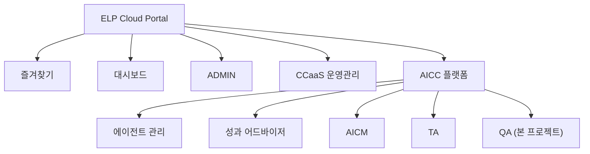
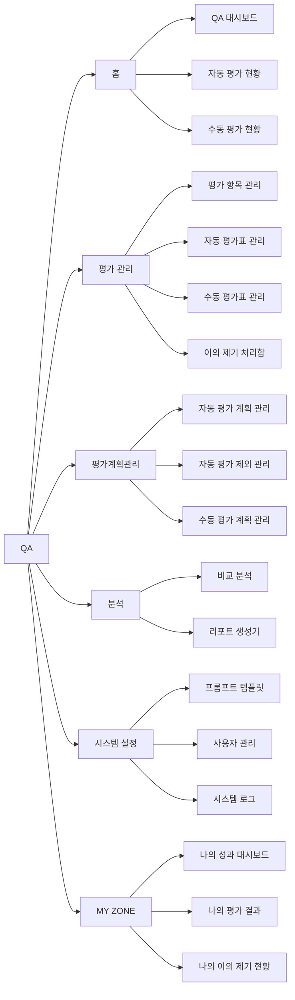

# AICC QA 솔루션 - 메뉴 구조도 및 화면 상세

> **문서 버전:** v1.0  
> **최종 수정일:** 2026-03-04  
> **기준 소스:** `js/components/sidebar.js` menuItems 정의

---

## 목차

- [1. 전체 메뉴 구조도](#1-전체-메뉴-구조도)
- [2. 메뉴 트리 (텍스트)](#2-메뉴-트리-텍스트)
- [3. 화면별 상세 설명](#3-화면별-상세-설명)
  - [3.1 홈](#31-홈)
  - [3.2 평가 관리](#32-평가-관리)
  - [3.3 평가계획관리](#33-평가계획관리)
  - [3.4 분석](#34-분석)
  - [3.5 시스템 설정](#35-시스템-설정)
  - [3.6 MY ZONE (상담사)](#36-my-zone-상담사)
  - [3.7 숨겨진 페이지](#37-숨겨진-페이지)
- [4. 권한별 메뉴 접근 매트릭스](#4-권한별-메뉴-접근-매트릭스)
- [5. 네비게이션 규칙](#5-네비게이션-규칙)

---

## 1. 전체 메뉴 구조도

### 1.1 ELP Cloud Portal 내 QA 위치



> 즐겨찾기, 대시보드, ADMIN, CCaaS 운영관리 및 AICC 플랫폼 하위의 QA 외 메뉴는 프로토타입에서 비활성 상태로 표시됩니다.

### 1.2 QA 서브메뉴 구조도



---

## 2. 메뉴 트리 (텍스트)

`sidebar.js`의 `menuItems` 정의를 기준으로 한 실제 구현 메뉴 트리입니다.

```
QA (품질 관리 시스템)
│
├── 👑 관리자 영역 ─────────────────────────────────────────
│
├── [홈]
│   ├── QA 대시보드              → pages/admin/qa-dashboard.html
│   ├── 자동 평가 현황            → pages/admin/evaluation-status.html
│   └── 수동 평가 현황            → pages/admin/manual-evaluation-status.html
│
├── [평가 관리]
│   ├── 평가 항목 관리            → pages/admin/evaluation-items.html
│   ├── 자동 평가표 관리           → pages/admin/evaluation-forms.html
│   ├── 수동 평가표 관리           → pages/admin/manual-evaluation-forms.html
│   └── 이의 제기 처리함           → pages/admin/dispute-inbox.html
│
├── [평가계획관리]
│   ├── 자동 평가 계획 관리        → pages/admin/system-settings/evaluation-plans.html
│   ├── 자동 평가 제외 관리        → pages/admin/system-settings/evaluation-exclusions.html
│   └── 수동 평가 계획 관리        → pages/admin/system-settings/manual-evaluation-plans.html
│
├── [분석]
│   ├── 비교 분석                → pages/admin/comparative-analysis.html
│   └── 리포트 생성기             → pages/admin/report-generator.html
│
│   ── ── ── ── ── ── ── ── ── ── (구분선)
│
├── [시스템 설정]
│   ├── 프롬프트 템플릿            → pages/admin/system-settings/prompt-templates.html
│   ├── 사용자 관리               → pages/admin/system-settings/user-management.html
│   └── 시스템 로그               → pages/admin/system-settings/system-logs.html
│
│   ── ── ── ── ── ── ── ── ── ── (구분선)
│
├── 👤 상담사 영역 (MY ZONE) ───────────────────────────────
│
├── 나의 성과 대시보드             → pages/agent/my-dashboard.html
├── 나의 평가 결과                → pages/agent/my-evaluations.html
└── 나의 이의 제기 현황            → pages/agent/my-disputes.html

─ ─ ─ ─ ─ ─ ─ ─ ─ ─ ─ ─ ─ ─ ─ ─ ─ ─ ─ ─ ─ ─ ─ ─ ─ ─

[숨겨진 페이지 - 사이드바에 미노출]
  └── 상세 분석                  → pages/admin/detail-analysis.html
      (QA 대시보드에서 페이지 이동으로 진입)
```

---

## 3. 화면별 상세 설명

### 3.1 홈

---

#### QA 대시보드

| 항목 | 내용 |
|------|------|
| **메뉴 ID** | `qa-dashboard` |
| **파일 경로** | `pages/admin/qa-dashboard.html` |
| **소속 그룹** | 홈 |
| **접근 권한** | 관리자 |
| **화면 목적** | 실시간 품질 모니터링 대시보드. 핵심 KPI와 차트를 한 화면에서 파악하여 즉각적인 품질 이슈를 식별합니다. |

**주요 기능:**

| 구분 | 상세 |
|------|------|
| **필터** | 기간 선택(PeriodPicker), 센터, 팀, 채널(I/B·O/B) |
| **차트** | 품질 추세(Line), 팀별 평균 점수(Bar), 점수 분포(Doughnut) — Chart.js |
| **테이블** | 팀별 평가 현황 (센터, 팀, 상담 건수, 평가 건수, 평균 점수, 이슈) |
| **긴급 이슈** | FAIL(금지어), 기준 미달, 이의 제기 발생 건을 카드로 표시 |
| **진입 경로** | 사이드바 메뉴 |

**화면 내 네비게이션:**

| 클릭 대상 | 이동 대상 | 방식 |
|-----------|-----------|------|
| 긴급 이슈 > FAIL/기준 미달 | 자동 평가 현황 | 페이지 이동 |
| 긴급 이슈 > 이의 제기 | 이의 제기 처리함 | 페이지 이동 |
| 팀별 평가 현황 행 | 상세 분석 | 페이지 이동 |
| 상세 보기 버튼 | 자동 평가 현황 | 페이지 이동 |

---

#### 자동 평가 현황

| 항목 | 내용 |
|------|------|
| **메뉴 ID** | `evaluation-status` |
| **파일 경로** | `pages/admin/evaluation-status.html` |
| **소속 그룹** | 홈 |
| **접근 권한** | 관리자 |
| **화면 목적** | AI 자동 평가 결과를 다양한 조건으로 필터링하여 조회하고, 개별 평가 건의 상세 내역을 확인합니다. |

**주요 기능:**

| 구분 | 상세 |
|------|------|
| **필터** | 센터, 팀, 기간, 상담사, 점수 범위, 통화유형(I/B·O/B), 평가표, 신뢰도, 상담유형, 이슈 유형(FAIL·기준 미달), 검증 상태 — 총 12개 |
| **테이블** | 상담 건별 평가 결과 (평가 ID, 일시, 팀, 상담유형, 유형, 통화시간, 상담사, 평가표, 점수, 신뢰도, 이슈) |
| **모달 1** | 평가 상세 — 메타정보, AI 피드백, 항목별 점수 탭, 스크립트 탭(구간별 재생), 수동 검증 버튼 |
| **모달 2** | 수동 검증 — 좌: 통화 스크립트+플레이어, 우: 항목별 점수 수정(NLP 항목 수정 불가), 검증 코멘트 |
| **페이지네이션** | 10/20/50건 선택 |
| **URL 파라미터** | `?issue=fail`, `?issue=under`, `?team=` 지원 (대시보드에서 딥링크 진입) |
| **진입 경로** | 사이드바 메뉴, QA 대시보드에서 페이지 이동 |

---

#### 수동 평가 현황

| 항목 | 내용 |
|------|------|
| **메뉴 ID** | `manual-evaluation-status` |
| **파일 경로** | `pages/admin/manual-evaluation-status.html` |
| **소속 그룹** | 홈 |
| **접근 권한** | 관리자 |
| **화면 목적** | 수동 평가 계획에 의해 선별된 상담 건의 평가 현황을 조회하고, 관리자가 직접 평가를 수행합니다. |

**주요 기능:**

| 구분 | 상세 |
|------|------|
| **필터** | 센터, 팀, 기간, 상담사, 평가자, 통화유형, 평가 상태(미평가·완료), 점수 범위, 평가표, 평가 계획, 상담유형 — 총 11개 |
| **테이블** | 수동 평가 대상 목록 (평가 ID, 일시, 팀, 상담유형, 유형, 통화시간, 상담사, 평가 계획, 평가표, 평가자, 점수, 평가 상태, 이슈) |
| **모달 1** | 수동 평가 상세 — 메타정보, 평가 계획·선별 기준, AI 피드백(참고용), 항목별 점수 탭, 스크립트 탭 |
| **모달 2** | 수동 평가 수행 — 좌: 통화 스크립트+플레이어, 우: 모든 항목 점수 수정 가능, 평가 코멘트 |
| **페이지네이션** | 10/20/50건 선택 |
| **진입 경로** | 사이드바 메뉴 |

---

### 3.2 평가 관리

---

#### 평가 항목 관리

| 항목 | 내용 |
|------|------|
| **메뉴 ID** | `evaluation-items` |
| **파일 경로** | `pages/admin/evaluation-items.html` |
| **소속 그룹** | 평가 관리 |
| **접근 권한** | 관리자 |
| **화면 목적** | 대분류 > 중분류 > 항목의 트리 구조로 평가 항목 라이브러리를 관리합니다. 평가표에 재사용할 항목을 중앙에서 정의합니다. |

**주요 기능:**

| 구분 | 상세 |
|------|------|
| **레이아웃** | 좌: 트리 뷰(3단계), 우: 선택 항목 상세 패널 |
| **트리 뷰** | 대분류 > 중분류 > 항목, 접기/펼치기, 인라인 카테고리·항목 추가 |
| **상세 패널** | 카테고리, 평가 방식(수동/NLP/AI), 배점, NLP·AI 설정, 편집/복사/삭제 버튼 |
| **모달 1** | 항목 추가/편집 — 카테고리 트리 선택, 항목명, 배점, 평가 방식, NLP·AI 설정 |
| **모달 2** | 카테고리 추가 — 대분류/중분류 위치, 카테고리명, 설명 |
| **삭제** | 확인 다이얼로그 |
| **진입 경로** | 사이드바 메뉴 |

---

#### 자동 평가표 관리

| 항목 | 내용 |
|------|------|
| **메뉴 ID** | `evaluation-forms` |
| **파일 경로** | `pages/admin/evaluation-forms.html` |
| **소속 그룹** | 평가 관리 |
| **접근 권한** | 관리자 |
| **화면 목적** | I/B(인바운드)·O/B(아웃바운드) 자동 평가표를 생성하고 관리합니다. 평가 항목 라이브러리에서 항목을 선택하여 평가표를 구성합니다. |

**주요 기능:**

| 구분 | 상세 |
|------|------|
| **필터** | 평가표명(검색), 평가 유형(전체/I·B/O·B), 상태(전체/사용 중/미사용) — 접이식 |
| **테이블** | 평가표 목록 (평가표명, 유형, 버전, 총점, 미달 기준, 항목 수, 상태, 수정일) |
| **모달 1** | 새 평가표 생성 — 항목 라이브러리 트리에서 체크박스 선택, 평가표명·유형·상태·총점·미달 기준 |
| **모달 2** | 평가표 상세 — 섹션별 아코디언, 항목 구성, Auto-Fail 규칙, 총점 미달 기준 |
| **모달 3** | 항목 라이브러리 피커 — 기존 평가표에 항목 추가 |
| **모달 4** | 항목 설정 — 개별 항목 배점·평가 방식 수정 |
| **진입 경로** | 사이드바 메뉴 |

---

#### 수동 평가표 관리

| 항목 | 내용 |
|------|------|
| **메뉴 ID** | `manual-evaluation-forms` |
| **파일 경로** | `pages/admin/manual-evaluation-forms.html` |
| **소속 그룹** | 평가 관리 |
| **접근 권한** | 관리자 |
| **화면 목적** | 수동 평가 전용 평가표를 생성하고 관리합니다. 자동 평가표와 유사하되, 코멘트 작성 가능 여부 등 수동 평가 전용 설정을 지원합니다. |

**주요 기능:**

| 구분 | 상세 |
|------|------|
| **필터** | 평가표명(검색), 평가 유형(전체/I·B/O·B), 상태(전체/사용 중/미사용) — 접이식 |
| **테이블** | 수동 평가표 목록 (평가표명, 유형, 버전, 총점, 미달 기준, 항목 수, 상태, 수정일) |
| **모달 1** | 새 수동 평가표 생성 — 항목 라이브러리 선택, 평가표명·유형·상태·총점·미달 기준 |
| **모달 2** | 평가표 상세 — 섹션별 아코디언, 코멘트 가능 아이콘 표시 |
| **모달 3** | 항목 설정 — 배점, 가점/감점, 평가 가이드, 코멘트 작성 가능 여부 |
| **진입 경로** | 사이드바 메뉴 |

---

#### 이의 제기 처리함

| 항목 | 내용 |
|------|------|
| **메뉴 ID** | `dispute-inbox` |
| **파일 경로** | `pages/admin/dispute-inbox.html` |
| **소속 그룹** | 평가 관리 |
| **접근 권한** | 관리자 |
| **화면 목적** | 상담사가 제출한 이의 제기를 접수·검토하고 승인 또는 반려 처리합니다. |

**주요 기능:**

| 구분 | 상세 |
|------|------|
| **KPI 카드** | 대기, 검토 중, 처리 완료 — 3개 |
| **필터** | 기간(PeriodPicker), 상태(전체/대기/검토 중/승인/반려), 팀, 상담사, 이의 항목, 처리자 — 총 6개 |
| **테이블** | 이의 제기 목록 (No, 제출일, 상담사, 팀, 평가 ID, 이의 항목, 원 점수, 상태, 처리자) |
| **모달** | 이의 제기 상세 — 대기/검토 중: 처리 의견·점수 수정 입력, 반려/수정 승인/승인 버튼. 처리 완료: 결과 조회만 |
| **상태 뱃지** | 대기·검토 중(노란색), 승인(녹색), 반려(빨간색) |
| **진입 경로** | 사이드바 메뉴, QA 대시보드 모달(긴급 이슈 > 이의 제기) |

---

### 3.3 평가계획관리

---

#### 자동 평가 계획 관리

| 항목 | 내용 |
|------|------|
| **메뉴 ID** | `evaluation-plans` |
| **파일 경로** | `pages/admin/system-settings/evaluation-plans.html` |
| **소속 그룹** | 평가계획관리 |
| **접근 권한** | 관리자 |
| **화면 목적** | 자동 평가의 실행 계획(기간, 대상, 적용 평가표, 반복 주기)을 생성하고 관리합니다. |

**주요 기능:**

| 구분 | 상세 |
|------|------|
| **필터** | 계획명(검색), 상태(진행 중/예정/종료), 반복 주기, 대상 — 총 4개 |
| **테이블** | 평가 계획 목록 (No, 계획명, 적용 평가표, 평가기간, 대상, 상태) |
| **모달 1** | 상세 — 기본정보, 대상 설정, 적용 평가표, 실행 통계. 상태별 삭제/복사/편집 또는 닫기/복사 |
| **모달 2** | 생성/편집 — 계획명, 시작·종료일, 반복 주기, 센터·팀·채널, 적용 평가표 |
| **기능** | 삭제, 복사 |
| **진입 경로** | 사이드바 메뉴 |

---

#### 자동 평가 제외 관리

| 항목 | 내용 |
|------|------|
| **메뉴 ID** | `evaluation-exclusions` |
| **파일 경로** | `pages/admin/system-settings/evaluation-exclusions.html` |
| **소속 그룹** | 평가계획관리 |
| **접근 권한** | 관리자 |
| **화면 목적** | 자동 평가 대상에서 제외할 규칙을 유형별로 관리합니다. 특정 상담사, 팀, 기간, 최소 통화시간 조건으로 제외 설정이 가능합니다. |

**주요 기능:**

| 구분 | 상세 |
|------|------|
| **탭** | 상담사 제외, 팀 제외, 기간 제외, 최소 통화시간 — 4개 |
| **테이블** | 탭별 제외 규칙 목록 (각 탭마다 상이한 컬럼 구성) |
| **모달 1** | 추가 — 탭별 전용 입력 폼 (듀얼리스트박스로 상담사·팀 다중 선택) |
| **모달 2** | 상세 — 제외 규칙 상세, 삭제/활성·비활성 토글/편집 |
| **모달 3** | 편집 — 탭별 규칙 수정 |
| **계단식 선택** | 센터 → 팀 → 상담사 |
| **진입 경로** | 사이드바 메뉴 |

---

#### 수동 평가 계획 관리

| 항목 | 내용 |
|------|------|
| **메뉴 ID** | `manual-evaluation-plans` |
| **파일 경로** | `pages/admin/system-settings/manual-evaluation-plans.html` |
| **소속 그룹** | 평가계획관리 |
| **접근 권한** | 관리자 |
| **화면 목적** | 수동 평가 대상 선정 기준과 실행 계획을 관리합니다. 자동 평가 계획보다 상세한 선별 조건(10종)을 지원합니다. |

**주요 기능:**

| 구분 | 상세 |
|------|------|
| **필터** | 계획명(검색), 상태(진행 중/예정/종료), 반복 주기, 대상, 담당자 — 총 5개 |
| **테이블** | 수동 평가 계획 목록 (No, 계획명, 적용 평가표, 평가기간, 대상, 상세 조건, 담당자, 상태) |
| **모달 1** | 상세 — 기본정보, 대상 설정, 상세 조건, 적용 평가표, 실행 통계 |
| **모달 2** | 생성/편집 — 상세 조건 10종 (근무일수, 샘플링, AI 점수, AI 신뢰도, 특정 상담사, 상담 유형, 통화 구간, 통화 시간, 상담 시간대, 요일) |
| **특수 UI** | 듀얼리스트박스(상담사 선택), 상담 유형 Depth 선택(1~4Depth cascading select) |
| **진입 경로** | 사이드바 메뉴 |

---

### 3.4 분석

---

#### 비교 분석

| 항목 | 내용 |
|------|------|
| **메뉴 ID** | `comparative-analysis` |
| **파일 경로** | `pages/admin/comparative-analysis.html` |
| **소속 그룹** | 분석 |
| **접근 권한** | 관리자 |
| **화면 목적** | 기간별 품질 점수 추이를 시각화하고, 팀 간 비교 분석을 제공합니다. |

**주요 기능:**

| 구분 | 상세 |
|------|------|
| **필터** | 센터, 팀(멀티셀렉트 드롭다운), 기간(PeriodPicker) — 총 3개 |
| **차트** | 품질 점수 추이 라인 차트 — 팀별 다중 시리즈 (Chart.js) |
| **테이블** | 기간 비교 분석 (팀, 센터, 현재 평균, 이전 평균, 변화, 최고점, 최저점, 추세) |
| **특수 UI** | 팀 멀티셀렉트 드롭다운 — 센터별 그룹핑, 체크박스 다중 선택 |
| **진입 경로** | 사이드바 메뉴 |

---

#### 리포트 생성기

| 항목 | 내용 |
|------|------|
| **메뉴 ID** | `report-generator` |
| **파일 경로** | `pages/admin/report-generator.html` |
| **소속 그룹** | 분석 |
| **접근 권한** | 관리자 |
| **화면 목적** | 일간/주간/월간 품질 분석 리포트를 설정하고, 미리보기 후 생성·다운로드합니다. |

**주요 기능:**

| 구분 | 상세 |
|------|------|
| **레이아웃** | 좌: 설정 패널, 우: 리포트 미리보기 |
| **설정** | 리포트 유형(일간/주간/월간 라디오 카드), 기간(시작·종료일), 범위(전체/센터/팀/개인), 템플릿(표준/경영진 요약/상세 분석/개선 과제), 포함 섹션(7개 체크박스) |
| **미리보기** | 품질 추이 차트(Chart.js), 팀별 비교 테이블, 상담사별 우수·개선 테이블, 이슈 현황 테이블 |
| **모달** | 다운로드 — PDF/Excel 형식 선택 |
| **진입 경로** | 사이드바 메뉴 |

---

### 3.5 시스템 설정

---

#### 프롬프트 템플릿

| 항목 | 내용 |
|------|------|
| **메뉴 ID** | `prompt-templates` |
| **파일 경로** | `pages/admin/system-settings/prompt-templates.html` |
| **소속 그룹** | 시스템 설정 |
| **접근 권한** | 관리자 |
| **화면 목적** | AI 평가용 프롬프트 템플릿을 중앙에서 관리합니다. 버전 이력을 통해 변경 추적이 가능합니다. |

**주요 기능:**

| 구분 | 상세 |
|------|------|
| **테이블** | 템플릿 목록 (No, 템플릿명, 카테고리, 유형, 사용횟수, 수정일) |
| **모달 1** | 상세 — 프롬프트 내용, 톤 설정, 사용 통계, 버전 이력 테이블(버전, 수정일, 수정자, 변경 내용). 삭제/복사/편집 버튼 |
| **모달 2** | 새 템플릿 추가 (개발 중) |
| **진입 경로** | 사이드바 메뉴 |

---

#### 사용자 관리

| 항목 | 내용 |
|------|------|
| **메뉴 ID** | `user-management` |
| **파일 경로** | `pages/admin/system-settings/user-management.html` |
| **소속 그룹** | 시스템 설정 |
| **접근 권한** | 관리자 |
| **화면 목적** | 시스템 사용자와 접근 범위(역할별 메뉴 권한)를 관리합니다. |

**주요 기능:**

| 구분 | 상세 |
|------|------|
| **필터** | 센터, 팀, 접속 권한(활성/비활성), 이름(검색), 이메일(검색) — 총 5개 |
| **테이블** | 사용자 목록 (No, 이름, 센터, 팀, 접근 범위, 접속 권한) |
| **모달 1** | 상세(읽기) — 이름, 이메일, 센터, 팀, 접속 권한, 가입일, 접근 범위(트리) |
| **모달 2** | 수정 — 동일 필드 편집 가능, 삭제/취소/저장 |
| **특수 UI** | 권한 트리 — 접기/펼치기, 부모/자식 체크 연동, indeterminate 체크박스 |
| **진입 경로** | 사이드바 메뉴 |

---

#### 시스템 로그

| 항목 | 내용 |
|------|------|
| **메뉴 ID** | `system-logs` |
| **파일 경로** | `pages/admin/system-settings/system-logs.html` |
| **소속 그룹** | 시스템 설정 |
| **접근 권한** | 관리자 |
| **화면 목적** | 시스템 활동 기록을 조회합니다. 읽기 전용이며 수정 기능은 없습니다. |

**주요 기능:**

| 구분 | 상세 |
|------|------|
| **필터** | 기간(PeriodPicker), 사용자(검색), 역할(관리자/QA 매니저/상담사), 액션 유형(로그인/설정 변경/평가 계획/템플릿/역할 변경/사용자 관리), IP 주소(검색) — 총 5개 |
| **테이블** | 로그 목록 (No, 일시, 사용자, 역할, 액션, 상세 내용, IP) |
| **모달** | 상세(읽기 전용) — 일시, IP, 사용자, 역할, 액션 유형, 상세 내용 |
| **진입 경로** | 사이드바 메뉴 |

---

### 3.6 MY ZONE (상담사)

> 관리자 로그인 시에도 "MY ZONE" 영역으로 접근할 수 있으며, 본인의 데이터만 표시됩니다.

---

#### 나의 성과 대시보드

| 항목 | 내용 |
|------|------|
| **메뉴 ID** | `my-dashboard` |
| **파일 경로** | `pages/agent/my-dashboard.html` |
| **소속 그룹** | MY ZONE |
| **접근 권한** | 관리자, 상담사 |
| **화면 목적** | 상담사 개인의 오늘 성과와 추이를 요약하여 보여줍니다. AI 코칭 피드백을 함께 제공합니다. |

**주요 기능:**

| 구분 | 상세 |
|------|------|
| **KPI 카드** | 오늘의 평균 점수, 팀 내 순위, 오늘 상담 건수 — 3개 |
| **차트** | 월별 평균 점수 추이 라인 차트 — 최근 6개월 (Chart.js) |
| **테이블** | 최근 평가 결과 (평가 ID, 일시, 유형, 통화시간, 점수, 주요 이슈) |
| **모달** | 평가 상세 — 메타정보, AI 피드백, 항목별 점수 테이블 |
| **AI 코칭** | 코칭 피드백 카드 영역 |
| **진입 경로** | 사이드바 메뉴 |

---

#### 나의 평가 결과

| 항목 | 내용 |
|------|------|
| **메뉴 ID** | `my-evaluations` |
| **파일 경로** | `pages/agent/my-evaluations.html` |
| **소속 그룹** | MY ZONE |
| **접근 권한** | 관리자, 상담사 |
| **화면 목적** | 상담사 본인의 평가 결과를 다양한 조건으로 필터링하여 조회하고, 이의 제기를 제출합니다. |

**주요 기능:**

| 구분 | 상세 |
|------|------|
| **필터** | 기간(PeriodPicker), 점수 범위, 통화 유형(I/B·O/B), 평가표, 이슈 유무, 신뢰도(High/Medium/Low), 상담유형 — 총 7개, 접이식 |
| **테이블** | 평가 결과 목록 (평가 ID, 일시, 유형, 통화시간, 점수, 신뢰도, 이슈) |
| **모달 1** | 평가 상세 — 메타정보, AI 피드백, 항목별 점수 탭, 스크립트 탭. 이의 제기 버튼 |
| **모달 2** | 이의 제기 — 평가 ID, 현재 점수, 이의 제기 항목(셀렉트), 요청 점수, 이의 제기 사유 |
| **페이지네이션** | 이전/다음, 페이지당 10/15/30건 |
| **진입 경로** | 사이드바 메뉴 |

---

#### 나의 이의 제기 현황

| 항목 | 내용 |
|------|------|
| **메뉴 ID** | `my-disputes` |
| **파일 경로** | `pages/agent/my-disputes.html` |
| **소속 그룹** | MY ZONE |
| **접근 권한** | 관리자, 상담사 |
| **화면 목적** | 상담사 본인이 제출한 이의 제기의 상태와 처리 결과를 확인합니다. |

**주요 기능:**

| 구분 | 상세 |
|------|------|
| **KPI 카드** | 총 제출, 처리 완료, 대기/검토 중 — 3개 |
| **테이블** | 이의 제기 목록 (No, 제출일, 평가 ID, 이의 항목, 원 점수, 요청 점수, 사유, 상태, 처리 결과) |
| **모달** | 상세 — 제출일, 평가 ID, 평가 총점, 상태, 이의 항목, 원·요청 점수, 이의 사유, 관리자 처리 결과(처리자, 처리일, 결과, 관리자 의견) |
| **진입 경로** | 사이드바 메뉴 |

---

### 3.7 숨겨진 페이지

> 사이드바 메뉴에 노출되지 않으며, 다른 화면에서 모달 또는 링크로만 진입할 수 있는 페이지입니다.

---

#### 상세 분석

| 항목 | 내용 |
|------|------|
| **메뉴 ID** | (사이드바 미등록) |
| **파일 경로** | `pages/admin/detail-analysis.html` |
| **소속 그룹** | 분석 (비노출) |
| **접근 권한** | 관리자 |
| **화면 목적** | 센터 → 팀 → 상담사 단위로 드릴다운하며 품질 데이터를 상세 분석합니다. |

**주요 기능:**

| 구분 | 상세 |
|------|------|
| **드릴다운** | Level 0(센터) → Level 1(팀) → Level 2(상담사) → Level 3(평가 이력) — 행 클릭으로 하위 레벨 진입 |
| **브레드크럼** | 전체 > 센터 > 팀 > 상담사 — 클릭으로 상위 이동 |
| **KPI 카드** | 레벨별 핵심 지표 3개 |
| **필터** | 기간(PeriodPicker), 통화 유형(전체/I·B/O·B), 점수 범위 — 총 3개 |
| **테이블** | 레벨별 4종 (센터·팀·상담사·평가 이력) |
| **모달** | 평가 상세 — 메타정보, AI 피드백, 항목별 점수 탭, 스크립트 탭(구간 재생), 수동 검증 버튼 |
| **URL 파라미터** | `?ct=`, `?team=` 딥링크 지원 |
| **진입 경로** | QA 대시보드 > 팀별 평가 현황 행 클릭 (페이지 이동) |

---

## 4. 권한별 메뉴 접근 매트릭스

| 메뉴 그룹 | 화면명 | 관리자 | 상담사 |
|-----------|--------|:------:|:------:|
| **홈** | QA 대시보드 | O | X |
| | 자동 평가 현황 | O | X |
| | 수동 평가 현황 | O | X |
| **평가 관리** | 평가 항목 관리 | O | X |
| | 자동 평가표 관리 | O | X |
| | 수동 평가표 관리 | O | X |
| | 이의 제기 처리함 | O | X |
| **평가계획관리** | 자동 평가 계획 관리 | O | X |
| | 자동 평가 제외 관리 | O | X |
| | 수동 평가 계획 관리 | O | X |
| **분석** | 비교 분석 | O | X |
| | 리포트 생성기 | O | X |
| | 상세 분석 (숨겨진) | O | X |
| **시스템 설정** | 프롬프트 템플릿 | O | X |
| | 사용자 관리 | O | X |
| | 시스템 로그 | O | X |
| **MY ZONE** | 나의 성과 대시보드 | O | O |
| | 나의 평가 결과 | O | O |
| | 나의 이의 제기 현황 | O | O |

> **관리자 로그인 시:** 관리자 영역 전체 + MY ZONE(본인 데이터) 표시  
> **상담사 로그인 시:** MY ZONE만 표시 (관리자 영역 숨김)

---

## 5. 네비게이션 규칙

### 5.1 사이드바 구조 (2단 구성)

| 구분 | 설명 |
|------|------|
| **1단 사이드바** | 고정 좌측 네비게이션. ELP Cloud Portal의 전체 메뉴 표시. QA 외 메뉴는 비활성(opacity: 0.75). |
| **2단 서브메뉴** | QA 메뉴 호버 시 오버레이로 표시되는 화이트 패널. 그룹별 메뉴 항목 나열. |

### 5.2 호버 인터랙션

```
1단 QA 메뉴 mouseenter → 2단 서브메뉴 표시
                          ↕ (마우스 이동 중 150ms 유예)
1단/2단 mouseleave       → 150ms 후 2단 숨김
2단 서브메뉴 mouseenter  → 숨김 타이머 취소, 유지
```

### 5.3 활성 메뉴 표시

- 현재 URL의 파일명과 `menuItems`의 `id`를 매칭하여 활성 메뉴 판별
- 활성 메뉴: 블루 배경(`#00A3FF`) + 흰색 텍스트
- 비활성 메뉴: 투명 배경 + `#424242` 텍스트

### 5.4 embed 모드 (iframe 진입)

- URL에 `embed=1` 파라미터가 포함되면 사이드바·헤더 없이 콘텐츠만 렌더링
- 다른 페이지에서 iframe으로 대상 페이지를 로드할 때 사용
- ※ QA 대시보드는 모달 대신 직접 페이지 이동 방식을 사용

---

### 관련 문서

- [01_기획_요구사항.md](./01_기획_요구사항.md) — 메뉴 구조 개요 및 기능 정의
- [02_디자인_시스템.md](./02_디자인_시스템.md) — UI 컴포넌트 및 디자인 가이드
- [03_개발_가이드.md](./03_개발_가이드.md) — 기술 스택 및 개발 가이드
