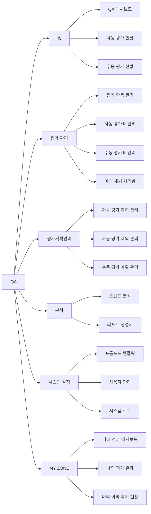

# AICC QA 솔루션 - 기능 정의서

> **문서 버전:** v4.0  
> **최종 수정일:** 2026-03-09  
> **기준 소스:** `js/components/sidebar.js` menuItems 정의

---

## 1. QA 메뉴 구조도

---

## 2. 기능 정의 상세 (최대 4-Depth)

| Depth 1 (메뉴 그룹) | Depth 2 (화면) | Depth 3 (모달) | Depth 4 (하위 모달) | 화면 목적 |
|---|---|---|---|---|
| **홈** | **QA 대시보드** | | | [KPI 카드 4개] {기간} 평가 상담사 수(명) / {기간} 상담 건수(건) / 평균 QA 점수(점) / 상담사 평균 통화시간(분:초) — 각 전기간 대비 변화량 표시. [차트 3개] 품질 추세(Line: 날짜별 평균 QA 점수) / 팀별 평균 점수(Bar: 팀별 점수, 채널 토글 전체·I/B·O/B) / 점수 분포(Doughnut: 우수90+·양호80~89·주의70~79·미달70-). [검색 조건] 기간(PeriodPicker: 일간·주간·월간·년간·사용자 지정) / 센터(Select) / 팀(Select, 센터 선택 시 활성화). [테이블] 팀별 평가 현황: 센터, 팀, 상담 건수, 평가 건수, 평균 점수, 이슈. [긴급 이슈] FAIL(금지어)·과락·이의 제기 발생 건 카드 |
| | | 긴급 이슈 클릭 | | FAIL/과락 클릭 → 자동 평가 현황(evaluation-status.html) 페이지 이동. 이의 제기 클릭 → 이의 제기 처리함(dispute-inbox.html) 페이지 이동 |
| | | 팀별 평가 현황 행 클릭 | | 팀 행 클릭 → 상세 분석(detail-analysis.html?ct=&team=) 페이지 이동. 센터→팀→상담사→평가 이력 4단계 드릴다운 분석 |
| | **자동 평가 현황** | | | [검색 조건 12개] 센터(Select) / 팀(Select, 센터 연동) / 기간(PeriodPicker) / 상담사(텍스트 검색) / 점수 범위(Select: 전체·80점 이상·60~79점·60점 미만) / 통화유형(Select: 전체·I/B·O/B) / 평가표(Select: 동적 목록) / 신뢰도(Select: 전체·90% 이상·70~89%·70% 미만) / 상담유형(텍스트 검색) / 이슈 유형(Select: 전체·FAIL(금지어)·과락) / 검증 상태(Select: 전체·검증 완료·미검증). 접이식 필터. [테이블] 상담 건별 평가 결과: 평가 ID, 일시, 팀, 상담유형, 유형, 통화시간, 상담사, 평가표, 점수, 신뢰도, 이슈. [페이지네이션] 10/20/50건. [URL 파라미터] ?issue=fail, ?issue=under, ?team= 딥링크 지원 |
| | | 평가 상세 모달 | | [상단 메타] 상담사, 팀, 유형(I/B·O/B), 일시, 통화시간, 총점, 평가표, 상담유형. [AI 피드백] 텍스트 영역. [탭 2개] 항목별 점수(평가 항목, 방식, 점수, 상태, 신뢰도) / 스크립트(시간별 상담사·고객 대화, 구간 클릭 재생). [버튼] 수동 검증, 닫기 |
| | | | 수동 검증 모달 | [2분할 레이아웃] 좌: 통화 스크립트 + 오디오 플레이어(재생·일시정지·진행 바). 우: 항목별 점수 수정 테이블(NLP 항목은 수정 불가 잠금), 검증 코멘트(textarea). [버튼] 취소, 검증 완료 |
| | **수동 평가 현황** | | | [검색 조건 11개] 센터(Select) / 팀(Select) / 기간(PeriodPicker) / 상담사(텍스트 검색) / 평가자(텍스트 검색) / 통화유형(Select: 전체·I/B·O/B) / 평가 상태(Select: 전체·미평가·평가 완료) / 점수 범위(Select: 전체·80점 이상·60~79점·60점 미만) / 평가표(Select: 동적 목록) / 평가 계획(Select: 동적 목록) / 상담유형(텍스트 검색). 접이식 필터. [테이블] 수동 평가 대상 목록: 평가 ID, 일시, 팀, 상담유형, 유형, 통화시간, 상담사, 평가 계획, 평가표, 평가자, 점수, 평가 상태, 이슈. [페이지네이션] 10/20/50건 |
| | | 수동 평가 상세 모달 | | [상단 메타] 상담사, 팀, 유형, 일시, 통화시간, 총점, 평가표, 상담유형. [추가 정보] 평가 계획명, 선별 기준, 평가 상태. [AI 피드백] 참고용. [탭 2개] 항목별 점수(AI 참고)(평가 항목, 방식, 점수, 상태, 신뢰도) / 스크립트(구간 재생). [버튼] 평가 진행(미평가 시) / 재평가(완료 시), 닫기 |
| | | | 수동 평가 수행 모달 | [2분할 레이아웃] 좌: 통화 스크립트 + 오디오 플레이어. 우: 모든 항목 점수 수정 가능(잠금 없음), 평가 코멘트(textarea). [버튼] 취소, 평가 완료 |
| **평가 관리** | **평가 항목 관리** | | | [2분할 레이아웃] 좌: 항목 트리(대분류 > 중분류 > 항목, 접기/펼치기). 우: 선택 항목 상세 패널. [트리 항목 표시] 이름, 타입 뱃지(Manual/NLP/AI), FAIL 마크, 사용여부(OFF). [상세 패널 정보] 카테고리, 평가 방식, 기본 배점, 평가종류(가점/감점), 사용여부, 설명, NLP 매칭 기준(스크립트 매칭·키워드 탐지·패턴 탐지·시간 측정), 평가 기준, AI 프롬프트, 사용 중인 평가표 목록. [버튼] + 항목(헤더), 편집·복사·삭제(상세 패널) |
| | | 항목 추가/편집 모달 | | [2분할] 좌: 카테고리 선택 트리(새 대분류 추가, 중분류별 + 버튼). 우: 입력 폼 — 항목명*, 사용여부(사용/미사용), 기본 배점(0~100), 평가종류(감점/가점), 평가 방식(수동/Auto-NLP/Auto-AI), 평가 기준(textarea), 설명(textarea). [NLP 선택 시] 매칭 방식(스크립트 매칭·키워드 탐지·패턴 탐지·시간 측정), 기준 문장, 매칭 키워드(쉼표 구분), 매칭 규칙 설명. [AI 선택 시] 프롬프트(textarea), 템플릿 불러오기·테스트 버튼. [버튼] 취소, 저장 |
| | | 카테고리 추가 모달 | | [2분할] 좌: 추가 위치 선택 트리. 우: 추가 위치(표시), 카테고리명*, 설명(textarea). [버튼] 취소, 저장 |
| | **자동 평가표 관리** | | | [검색 조건] 평가표명(텍스트 검색) / 평가 유형(Select: 전체·I/B·O/B) / 상태(Select: 전체·사용 중·미사용). 접이식 필터. [테이블] 평가표 목록: 평가표명, 유형, 버전, 총점, 과락 기준, 항목 수, 상태, 수정일. [버튼] + 새 평가표(헤더), 초기화·검색(필터), 행 클릭 → 상세 모달 |
| | | 새 평가표 생성 모달 | | [2분할 55:45] 좌: 항목 라이브러리 트리(대분류 > 중분류 > 항목, 체크박스 다중 선택). 우: 선택 항목 N개 목록(배점 입력, 감점/가점 선택). [상단 입력] 평가표명*, 유형(I/B·O/B), 상태(사용 중·미사용), 총점(readonly, 자동 합산), 과락 기준(점 미만). [버튼] 취소, 생성 |
| | | | 항목 설정 모달 | [필드] 항목명(readonly), 배점(number), 평가 방식(readonly), 소속 섹션(readonly). [버튼] 삭제, 취소, 저장 |
| | | 평가표 상세 모달 | | [상단 정보] 유형, 총점, 항목 수, 작성자, 수정일. [Auto-Fail 규칙] 해당 시 표시. [총점 과락 기준]. [평가 항목 구성] 섹션별 아코디언(접기/펼치기), 항목: 이름, 배점, 타입 뱃지, 설정 버튼. [버튼] + 항목 라이브러리에서 추가, 닫기 |
| | | | 항목 라이브러리 피커 모달 | [2분할 55:45] 좌: 항목 라이브러리 트리(이미 추가된 항목 비활성). 우: 선택한 항목 목록. [버튼] 취소, 추가 |
| | | | 항목 설정 모달 | [필드] 항목명(readonly), 배점(number), 평가 방식(readonly), 소속 섹션(readonly). [버튼] 삭제, 취소, 저장 |
| | **수동 평가표 관리** | | | [검색 조건] 평가표명(텍스트 검색) / 평가 유형(Select: 전체·I/B·O/B) / 상태(Select: 전체·사용 중·미사용). 접이식 필터. [테이블] 수동 평가표 목록: 평가표명, 유형, 버전, 총점, 과락 기준, 항목 수, 상태, 수정일. [버튼] + 새 평가표(헤더) |
| | | 새 수동 평가표 생성 모달 | | [2분할 50:50] 좌: 항목 라이브러리 트리(NLP/AI 뱃지 없음). 우: 선택 항목 N개(배점, 감점/가점, 평가 가이드, 코멘트 작성 가능 체크). [상단 입력] 평가표명*, 유형(I/B·O/B), 상태, 총점(readonly), 과락 기준. [버튼] 취소, 생성 |
| | | | 항목 설정 모달 | [필드] 항목명(readonly), 배점(number), 가점/감점(Select), 평가 가이드(textarea), 코멘트 작성 가능(체크박스), 소속 섹션(readonly). [버튼] 삭제, 취소, 저장 |
| | | 평가표 상세 모달 | | [상단 정보] 유형, 총점, 항목 수, 작성자, 수정일. [총점 과락 기준]. [평가 항목 구성] 섹션별 아코디언, 항목: 이름, 배점, 감점/가점, 코멘트 가능 아이콘(💬), 가이드, 설정 버튼. [버튼] + 항목 추가, 닫기 |
| | | | 항목 설정 모달 | [필드] 항목명(readonly), 배점, 가점/감점, 평가 가이드(textarea), 코멘트 작성 가능(체크박스), 소속 섹션(readonly). [버튼] 삭제, 취소, 저장 |
| | **이의 제기 처리함** | | | [KPI 카드 3개] 대기(건) / 검토 중(건) / 처리 완료(건). [검색 조건 6개] 기간(PeriodPicker) / 상태(Select: 전체·대기·검토 중·승인·반려) / 팀(Select: 동적) / 상담사(텍스트 검색) / 이의 항목(Select: 동적) / 처리자(텍스트 검색). [테이블] 이의 제기 목록: No, 제출일, 상담사, 팀, 평가 ID, 이의 항목, 원 점수, 상태, 처리자. [상태 뱃지] 대기·검토 중(노란), 승인(녹색), 반려(빨강) |
| | | 이의 제기 상세 모달 | | [정보 그리드] 평가 ID, 제출일, 상담사(팀), 이의 항목, 원 점수, 현재 상태. [상담사 이의 사유] 읽기 전용 textarea. [대기/검토 중] 처리 의견(textarea), 점수 수정(number, 선택). [버튼] 취소, 반려, 수정 승인, 승인. [처리 완료] 처리 결과(처리자·처리일) 읽기 전용. [버튼] 닫기 |
| **평가계획관리** | **자동 평가 계획 관리** | | | [검색 조건 4개] 계획명(텍스트 검색) / 상태(Select: 전체·진행 중·예정·종료) / 반복 주기(Select: 전체 + 동적) / 대상(텍스트 검색). 접이식 필터. [테이블] 평가 계획 목록: No, 계획명, 적용 평가표, 평가기간, 대상, 상태. [버튼] + 새 계획 추가(헤더) |
| | | 계획 상세 모달 | | [기본 정보] 계획명, 반복 주기, 시작일, 종료일, 상태. [대상 설정] 센터, 팀, 채널(I/B·O/B). [적용 평가표]. [실행 통계] 총 평가 건수, 성공률, 평균 처리 시간. [버튼] 진행 중/예정: 삭제·복사·편집. 종료: 닫기·복사 |
| | | 계획 생성/편집 모달 | | [입력 필드] 계획명*, 시작일*, 종료일(date), 반복 주기(라디오: 지속·1회성·매주·매월). [대상 설정] 센터(Select), 팀(체크박스), 채널(I/B·O/B). [적용 평가표] Select. [버튼] 취소, 생성/저장 |
| | **자동 평가 제외 관리** | | | [탭 4개] 상담사 제외 / 팀 제외 / 기간 제외 / 최소 통화시간. [테이블 — 탭별 상이] 상담사 제외: No, 상담사, 소속, 사유, 적용 기간, 상태. 팀 제외: No, 팀, 사유, 적용 기간, 상태. 기간 제외: No, 제외 기간, 대상 범위, 사유, 상태. 최소 통화시간: No, 적용 대상, 기준 시간, 사유, 상태. [버튼] + 추가(탭 영역) |
| | | 제외 규칙 추가 모달 | | [상담사 제외] 센터*, 팀*, 상담사(듀얼리스트박스: 검색·전체 추가/제거), 시작일*, 종료일*, 사유. [팀 제외] 센터*, 팀 선택(듀얼리스트박스), 시작일*, 종료일*, 사유. [기간 제외] 시작일*, 종료일*, 대상 범위(라디오: 전체/특정 대상 → 센터·팀 체크박스), 사유. [최소 통화시간] 적용 대상(라디오: 전체·I/B·O/B), 기준 시간(초, 1~300)*, 사유. [버튼] 취소, 추가 |
| | | 제외 규칙 상세 모달 | | [탭별 상세 정보 표시]. [버튼] 삭제, 비활성화/활성화 토글, 편집 |
| | | | 제외 규칙 편집 모달 | 탭별 규칙 수정 폼(추가 모달과 동일 구조). [버튼] 취소, 저장 |
| | **수동 평가 계획 관리** | | | [검색 조건 5개] 계획명(텍스트 검색) / 상태(Select: 전체·진행 중·예정·종료) / 반복 주기(Select: 전체 + 동적) / 대상(텍스트 검색) / 담당자(텍스트 검색). 접이식 필터. [테이블] 수동 평가 계획 목록: No, 계획명, 적용 평가표, 평가기간, 대상, 상세 조건, 담당자, 상태. [버튼] + 새 계획 추가(헤더) |
| | | 계획 상세 모달 | | [기본 정보] 계획명, 반복 주기, 시작일, 종료일, 상태. [대상 설정] 센터, 팀, 채널. [상세 조건] 적용된 조건 목록. [적용 평가표]. [실행 통계] 총 대상 건수, 완료 건수, 미완료 건수. [버튼] 진행 중/예정: 삭제·복사·편집. 종료: 닫기·복사 |
| | | 계획 생성/편집 모달 | | [기본 입력] 계획명*, 시작일*, 종료일, 반복 주기(라디오: 지속·1회성·매주·매월). [대상 설정] 센터, 팀(체크박스), 채널. [상세 조건 10종 — 체크박스 + 세부 입력] 근무일수 기준(일 미만) / 샘플링 비율(%) / AI 점수 기준(점 미만) / AI 신뢰도 기준(High·Medium·Low 이하) / 특정 상담사 지정(센터→팀→듀얼리스트박스) / 상담 유형(Depth: 전체·1~4Depth cascading select) / 통화 구간 지정(전체 구간·시작~종료) / 통화 시간 범위(최소~최대 분) / 상담 시간대(시작~종료) / 요일 필터(월~일 체크박스). [적용 평가표] Select. [평가 담당자]. [버튼] 취소, 생성/저장 |
| **분석** | **트렌드 분석** | | | [검색 조건 3개] 센터(Select: 전체·서울센터·부산센터·대구센터) / 팀 선택(멀티셀렉트 드롭다운: 센터별 팀 그룹, 체크박스 다중 선택) / 기간(PeriodPicker: 일간·주간·월간·년간·커스텀). [차트] 품질 점수 추이(Line Chart: 팀별 다중 시리즈, Chart.js). [테이블] 기간 비교 분석: 팀, 센터, 현재 평균, 이전 평균, 변화, 최고점, 최저점, 추세. 필터 변경 시 자동 적용(별도 검색 버튼 없음) |
| | **리포트 생성기** | | | [2분할 레이아웃] 좌(400px): 설정 패널. 우: 미리보기(sticky). [리포트 유형] 일간·주간·월간(라디오 카드). [기간 및 범위] 시작일~종료일 / 범위(Select: 전체·센터 단위·팀 단위·개인 단위 → 하위 Select). [템플릿] 표준·경영진 요약·상세 분석·개선 과제. [포함 섹션 — 체크박스 7개] 요약(KPI 현황) / 품질 추이 차트 / 팀별 비교 분석 / 상담사별 분석 / 이슈 현황 / 개선 제안 / 부록(상세 데이터). [미리보기] 상태 배지(미생성·생성 완료), KPI 4개(총 상담 건수·총 평가 건수·평균 QA 점수·이슈 건수), 품질 추이 차트(Line), 팀별 비교 테이블, 상담사별 우수·개선 Top 5, 이슈 현황 테이블. [버튼] 리포트 생성, 다운로드 |
| | | 다운로드 모달 | | [다운로드 형식 선택] PDF 다운로드 / Excel 다운로드. [버튼] 취소 |
| **시스템 설정** | **프롬프트 템플릿** | | | [테이블] 템플릿 목록: No, 템플릿명, 카테고리, 유형, 사용횟수, 수정일. [버튼] + 새 템플릿(헤더, 개발 중) |
| | | 템플릿 상세 모달 | | [정보] 템플릿명, 카테고리, 유형. [프롬프트 내용] 코드 블록 스타일 표시. [톤 설정] 엄격·표준·관대. [사용 통계] 총 사용횟수, 최종 수정일. [버전 이력 테이블] 버전, 수정일, 수정자, 변경 내용. [버튼] 삭제, 복사, 편집 |
| | **사용자 관리** | | | [검색 조건 5개] 센터(Select: 전체 + 동적) / 팀(Select: 전체 + 동적) / 접속 권한(Select: 전체·활성·비활성) / 이름(텍스트 검색) / 이메일(텍스트 검색). [테이블] 사용자 목록: No, 이름, 센터, 팀, 접근 범위, 접속 권한 |
| | | 사용자 상세 모달 | | [정보] 이름, 이메일, 센터, 팀, 접속 권한, 가입일. [접근 범위] 권한 트리(읽기 전용): 관리자 영역·상담사 영역·데이터 범위(하위 노드 접기/펼치기). [버튼] 닫기, 수정 |
| | | | 사용자 수정 모달 | [입력 필드] 이름*, 이메일*, 센터(Select), 팀(Select), 접속 권한(Select: 활성·비활성), 가입일. [접근 범위] 권한 트리(체크박스, 부모/자식 연동, indeterminate 상태). [버튼] 삭제, 취소, 저장 |
| | **시스템 로그** | | | [검색 조건 5개] 기간(PeriodPicker) / 사용자(텍스트 검색) / 역할(Select: 전체·관리자·QA 매니저·상담사) / 액션 유형(Select: 전체·로그인·설정 변경·평가 계획·템플릿·역할 변경·사용자 관리) / IP 주소(텍스트 검색). [테이블] 로그 목록: No, 일시, 사용자, 역할, 액션, 상세 내용, IP. 읽기 전용 |
| | | 로그 상세 모달 | | [정보] 일시, IP 주소, 사용자, 역할, 액션 유형, 상세 내용(전체 텍스트). 읽기 전용. [버튼] 닫기 |
| **MY ZONE** | **나의 성과 대시보드** | | | [KPI 카드 3개] 오늘의 평균 점수(점, 전일 대비 변화) / 팀 내 순위(위, N명 중 상위 %) / 오늘 상담 건수(건, 전일 대비 변화). [차트] 월별 평균 점수 추이(Line Chart: 최근 6개월). [테이블] 최근 평가 결과: 평가 ID, 일시, 유형, 통화시간, 점수, 주요 이슈. [AI 코칭 피드백] 카드 영역. [버튼] 전체 보기 → 나의 평가 결과로 이동 |
| | | 평가 상세 모달 | | [상단 메타] 상담사, 팀, 유형, 일시, 통화시간, 총점, 평가표, 상담유형. [AI 피드백]. [항목별 점수 테이블] 평가 항목, 방식, 점수, 상태. [버튼] 닫기 |
| | **나의 평가 결과** | | | [검색 조건 7개] 기간(PeriodPicker) / 점수 범위(Select: 전체·80점 이상·60~79점·60점 미만) / 통화 유형(Select: 전체·I/B·O/B) / 평가표(Select: 동적) / 이슈 유무(Select: 전체·이슈 있음·이슈 없음) / 신뢰도(Select: 전체·High·Medium·Low) / 상담유형(텍스트 검색). 접이식 필터. [테이블] 평가 결과 목록: 평가 ID, 일시, 유형, 통화시간, 점수, 신뢰도, 이슈. [페이지네이션] 10/15/30건 |
| | | 평가 상세 모달 | | [상단 메타] 상담사, 팀, 유형, 일시, 통화시간, 총점, 평가표, 상담유형. [AI 피드백]. [탭 2개] 항목별 점수(평가 항목, 방식, 점수, 상태) / 스크립트(시간별 대화). [버튼] 이의 제기, 닫기 |
| | | | 이의 제기 모달 | [읽기 전용] 평가 ID, 현재 점수. [입력 필드] 이의 제기 항목(Select: 인사 멘트·고객 확인·경청/공감·문제 파악·해결 제시·정확성·종결 멘트), 요청 점수(number, 0~100, step 0.5), 이의 제기 사유(textarea). [버튼] 취소, 이의 제기 제출 |
| | **나의 이의 제기 현황** | | | [KPI 카드 3개] 총 제출(건) / 처리 완료(건) / 대기·검토 중(건). [테이블] 이의 제기 목록: No, 제출일, 평가 ID, 이의 항목, 원 점수, 요청 점수, 사유, 상태, 처리 결과. [상태 뱃지] 대기·검토 중(노란), 승인(녹색), 반려(빨강), 수정 승인(파랑) |
| | | 이의 제기 상세 모달 | | [상단 메타] 제출일, 평가 ID, 평가 총점, 상태. [이의 내용] 이의 항목, 원 점수, 요청 점수, 이의 제기 사유. [관리자 처리 결과 — 처리 완료 시] 처리자, 처리일, 결과, 관리자 의견. [미처리 시] "아직 처리되지 않았습니다. 관리자 검토 후 결과가 반영됩니다." [버튼] 닫기 |

---

## 3. 권한별 메뉴 접근

| 메뉴 그룹 | 화면명 | 관리자 | 상담사 |
|-----------|--------|:------:|:------:|
| 홈 | QA 대시보드 | O | X |
| | 자동 평가 현황 | O | X |
| | 수동 평가 현황 | O | X |
| 평가 관리 | 평가 항목 관리 | O | X |
| | 자동 평가표 관리 | O | X |
| | 수동 평가표 관리 | O | X |
| | 이의 제기 처리함 | O | X |
| 평가계획관리 | 자동 평가 계획 관리 | O | X |
| | 자동 평가 제외 관리 | O | X |
| | 수동 평가 계획 관리 | O | X |
| 분석 | 트렌드 분석 | O | X |
| | 리포트 생성기 | O | X |
| 시스템 설정 | 프롬프트 템플릿 | O | X |
| | 사용자 관리 | O | X |
| | 시스템 로그 | O | X |
| MY ZONE | 나의 성과 대시보드 | O | O |
| | 나의 평가 결과 | O | O |
| | 나의 이의 제기 현황 | O | O |

> **관리자:** 관리자 영역 전체 + MY ZONE(본인 데이터)  
> **상담사:** MY ZONE만 표시 (관리자 영역 숨김)

---

## 4. 네비게이션 규칙

| 항목 | 설명 |
|------|------|
| **1단 사이드바** | 고정 좌측. ELP Cloud Portal 전체 메뉴 표시. QA 외 메뉴 비활성(opacity: 0.75) |
| **2단 서브메뉴** | QA 메뉴 호버 시 화이트 오버레이 패널로 표시 |
| **호버 유예** | 1단↔2단 마우스 이동 중 150ms 유예 후 닫힘 |
| **활성 메뉴** | 현재 URL 파일명과 menuItems ID 매칭. 블루 배경(`#00A3FF`) + 흰색 텍스트 |
| **embed 모드** | URL에 `embed=1` 포함 시 사이드바·헤더 없이 콘텐츠만 렌더링 (iframe 진입용). ※ QA 대시보드는 모달 대신 페이지 이동 방식 사용 |

---

### 관련 문서

- [01_기획_요구사항.md](./01_기획_요구사항.md) — 메뉴 구조 개요 및 기능 정의
- [02_디자인_시스템.md](./02_디자인_시스템.md) — UI 컴포넌트 및 디자인 가이드
- [03_개발_가이드.md](./03_개발_가이드.md) — 기술 스택 및 개발 가이드
